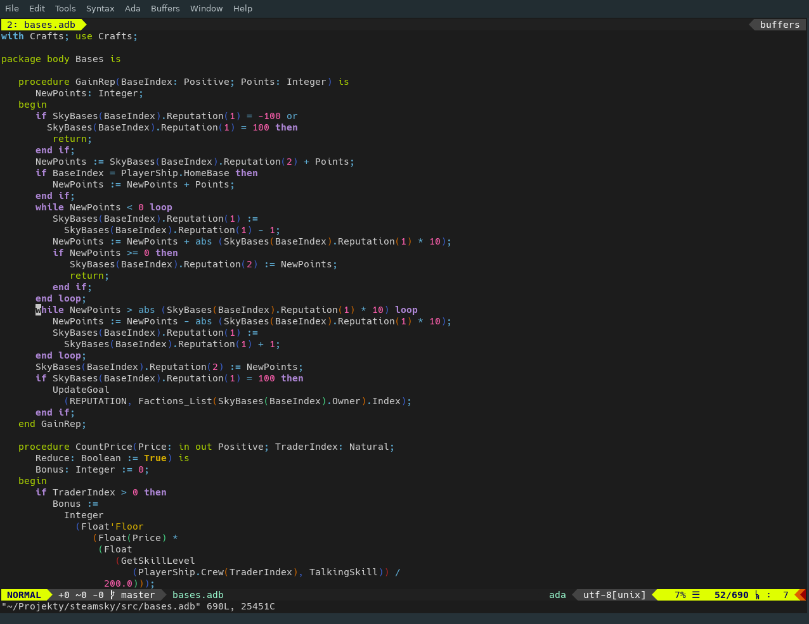
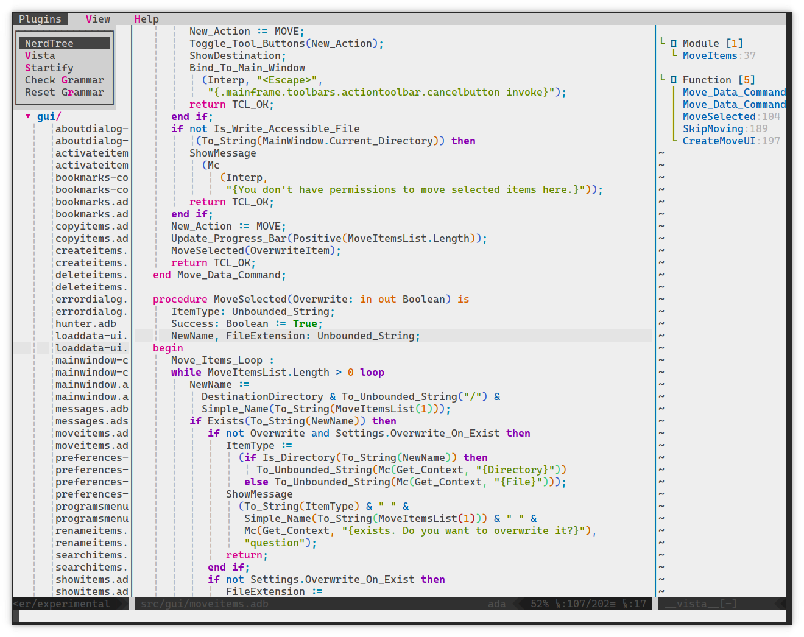

## General Info

Vim-Ada is ready to deploy set of plugins and settings which helps write Ada
programs. See "Installation" section for detailed instructions how to install
it and "Plugins" section for informations about included plugins and changes
(if any) to them.

All changes to plugins are under respective plugin license which can be found
in plugins directory. If plugin don't have license info included, then all my
changes are in public domain.

## Screenshots

## Installation

Just copy directory `vimada` to your Vim `runtimepath` directory (on Unix
systems it is often `$HOME/.vim`) to directory `pack` (so, full path on Unix
will be looks like `$HOME/.vim/pack/vimada`).

To enable all options, you been need to install Universal Ctags (this version
is maintained and have full support for Ada language) from https://ctags.io

Additionally, you can put included `.vimrc` file as a configuration file (or
source it from your configuration file).

After installation, it is recommended to run inside Vim command `:helptags
ALL` to generate help tags.

## Plugins

### A.vim

Webpage: https://www.vim.org/scripts/script.php?script_id=31

Allow fast switch between spec (.ads) and body (.adb) files. This plugin don't
have any help, so I recommend to visit website to read plugins command. This
plugin wasn't modified.

### AdaBundle

Webpage: https://www.vim.org/scripts/script.php?script_id=1609

This is modified version of standard Ada support for Vim. Main changes:

- Changed support from Rainbow Parenthesis to Rainbow Parentheses Improved
  plugin (which is included in this pack too).
- Removed all tags commands which are now in base Vim (like jump to tag).
- Added support for Syntastic plugin (included in this pack too).
- Updated help file.
- Removed support for Dec Ada compiler.
- Fixed and extended support for vim sessions on loading GNAT project files
  (it is possible to enable or disable it).

### AdaSpec

Webpage: http://www.ada-auth.org/arm.html

Text version of Ada 2012 language specification with added some tags for
Vim help.

### Airline

Webpage: https://github.com/vim-airline/vim-airline

Status bar and buffer list for Vim. This plugin wasn't modified but have some
custom configuration in `.vimrc` file.

### Auto-pairs

Webpage: https://github.com/jiangmiao/auto-pairs

Insert or delete brackets, quotes in pair. This plugin wasn't modified.

### Fugitive

Webpage: https://github.com/tpope/vim-fugitive

Git wrapper, allow do a lots of git "things" inside Vim. This plugin wasn't
modified.

### GitGutter

Webpage: https://github.com/airblade/vim-gitgutter

Shows a git diff in the 'gutter' (sign column). It shows which lines have been
added, modified, or removed. You can also preview, stage, and undo individual
hunks. The plugin also provides a hunk text object. This plugin wasn't
modified but have some custom configuration in `.vimrc` file.

### GutenTags

Webpage: https://github.com/ludovicchabant/vim-gutentags

Gutentags is a plugin that takes care of the much needed management of tags
files in Vim. It will (re)generate tag files as you work while staying
completely out of your way. It will even do its best to keep those tag files
out of your way too. It has no dependencies and just works. This plugin wasn't
modified.

### IndentLine

Webpage: https://github.com/Yggdroot/indentLine

This plugin is used for displaying thin vertical lines at each indentation
level for code indented with spaces. This plugin wasn't modified but have some
custom configuration in `.vimrc` file.

### Rainbow Parentheses Improved

Webpage: https://github.com/luochen1990/rainbow

Updated version of Rainbow Parenthesis. Help you read complex code by showing
diff level of parentheses in diff color. This plugin wasn't modified but have
some custom configuration in `.vimrc` file.

### Startify

Webpage: https://github.com/mhinz/vim-startify

This plugin provides a start screen for Vim. It provides dynamically created
headers or footers and uses configurable lists to show recently used or
bookmarked files and persistent sessions. All of this can be accessed in a
simple to use menu that even allows to open multiple entries at once.

### Syntastic

Webpage: https://github.com/vim-syntastic/syntastic

Syntastic is a syntax checking plugin for Vim created by Martin Grenfell. It
runs files through external syntax checkers and displays any resulting errors
to the user. This can be done on demand, or automatically as files are saved.
If syntax errors are detected, the user is notified and is happy because they
didn't have to compile their code or execute their script to find them. This
plugin have changes to Ada support:

- Default checking flag was changed from `-gnats` to `-gnatc`.
- Fixed it to work with GNAT project files too.

Additionally, this plugin have some custom configuration in `.vimrc` file
which is required to proper work of plugin.

### Xml

Webpage: none

This is just one line setting to enable spellchecking in XML files too.

### PaperColor

Webpage: https://github.com/NLKNguyen/papercolor-theme

Used as default theme for Vim, have some additional support for Ada syntax.
Comes in two versions: dark (default if you use included `.vimrc`
configuration file) and light (default for no configuration). It is unmodified,
only some custom configuration is in `.vimrc` file.

-------

That's probably all, feel free to use project Issues if you have any
problems, questions, ideas, bug reports about this pack.

Bartek thindil Jasicki
